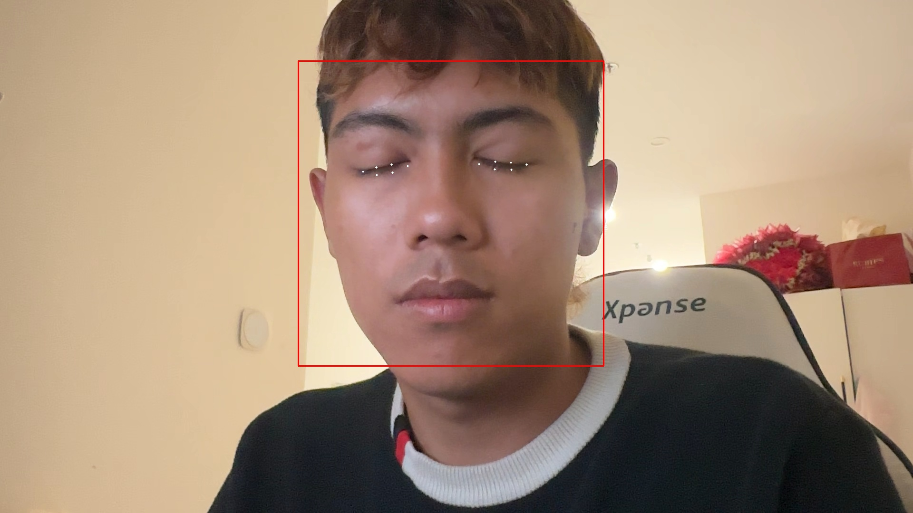
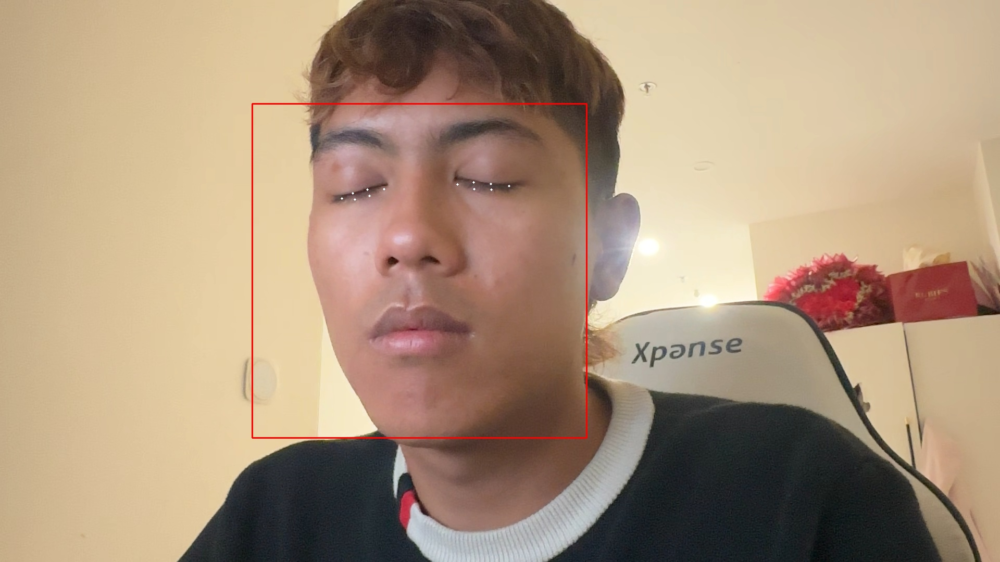
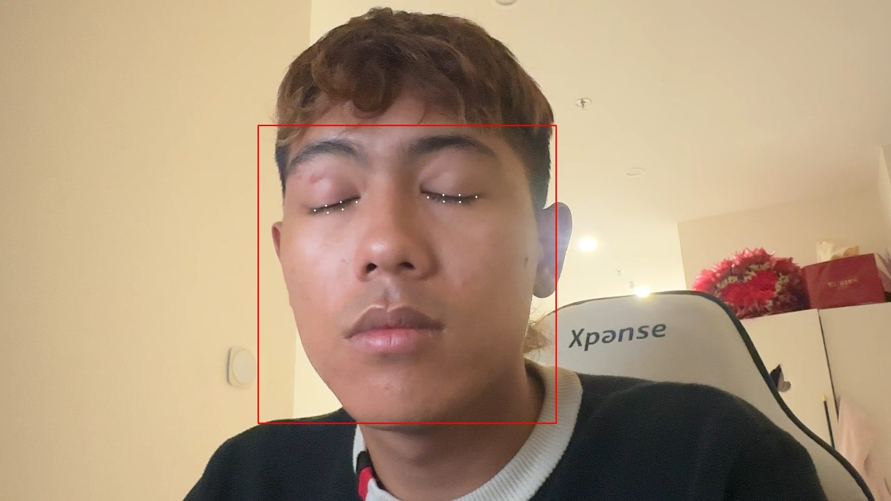
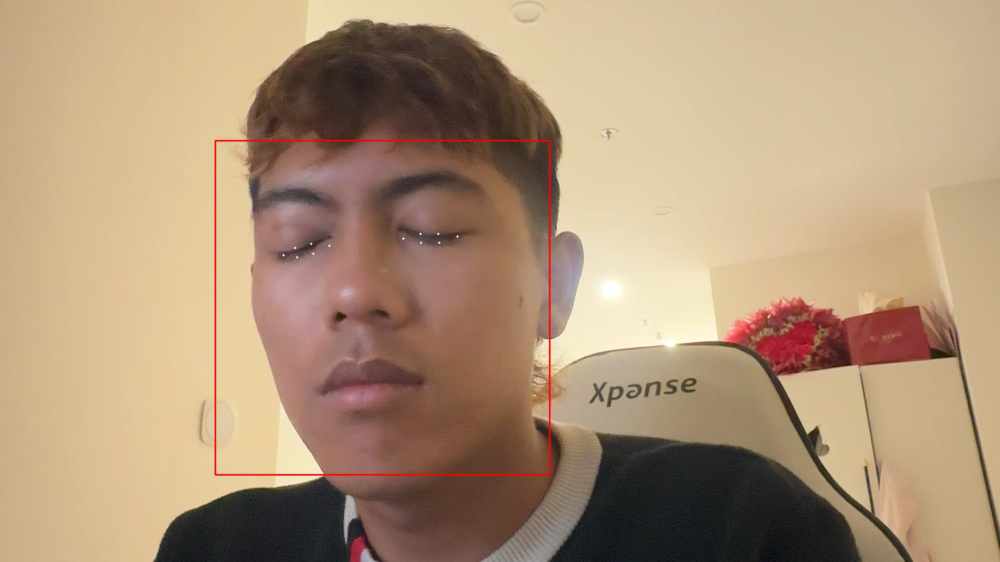

# Hệ thống cảnh báo ngủ gật cho tài xế

Hệ thống này phát hiện tài xế ngủ gật bằng EAR và PERCLOS, sử dụng OpenCV và dlib.
Nó hiển thị giao diện HUD bằng tiếng Việt, đưa ra cảnh báo, ghi nhật ký và chụp ảnh khi phát hiện ngủ gật.

## Tính năng

- Phát hiện khuôn mặt và landmark mắt bằng dlib
- Tính toán chỉ số EAR (Eye Aspect Ratio)
- Tính toán PERCLOS trên cửa sổ khung hình
- Cảnh báo bằng HUD và âm thanh khi tài xế ngủ gật
- Ghi file log sự kiện
- Chụp ảnh sự kiện khi phát hiện ngủ gật
- Hỗ trợ cảnh báo khi không tìm thấy mặt

## Cài đặt môi trường

1. Tạo virtual environment và kích hoạt:

```bash
python3 -m venv .venv
source .venv/bin/activate
```

2. Cài đặt phụ thuộc:

```bash
pip install -r requirements.txt
```

Nếu bạn chưa cài `requirements.txt` trước đó, nội dung này đã được thêm vào repo với các gói cần thiết sau:

```text
opencv-python
numpy
scipy
dlib
pygame
```

Nếu bạn muốn cài thủ công thay vì dùng file, bạn có thể dùng:

```bash
pip install opencv-python dlib numpy scipy pygame
```

## Cấu hình Git LFS

File mô hình `shape_predictor_68_face_landmarks.dat` được quản lý bằng Git LFS.
Nếu chưa cài Git LFS, cài đặt và khởi tạo:

```bash
brew install git-lfs
git lfs install
```

## Tải dữ liệu mô hình

1. Tải file mô hình từ dlib:

```bash
curl -L -O http://dlib.net/files/shape_predictor_68_face_landmarks.dat.bz2
```

2. Giải nén file:

```bash
bunzip2 shape_predictor_68_face_landmarks.dat.bz2
```

3. Di chuyển file vào thư mục `src/`:

```bash
mv shape_predictor_68_face_landmarks.dat src/
```

## Cách chạy

Chạy hệ thống với camera mặc định:

```bash
python3 src/main.py --camera 0
```

Hoặc chỉ định file log và thư mục ảnh chụp:

```bash
python3 src/main.py --camera 0 --log-file ./drowsiness_log.csv --snapshot-dir ./snapshots
```

## Demo ảnh snapshot

Các ảnh snapshot sau đây được chụp tự động khi hệ thống phát hiện tài xế ngủ gật.









## Tham số tùy chọn

- `--disable-audio`: tắt âm thanh cảnh báo
- `--ear-threshold`: ngưỡng EAR để xác định mắt đóng
- `--sleep-seconds`: số giây mắt đóng liên tục để phát hiện ngủ gật
- `--perclos-window`: số khung hình để tính PERCLOS
- `--perclos-threshold`: ngưỡng PERCLOS để cảnh báo
- `--snapshot-dir`: thư mục lưu ảnh khi ngủ gật

## Ghi chú

- Nếu bạn chạy trên macOS, cảnh báo SDL trùng lặp có thể xuất hiện vì cả OpenCV và pygame cùng chứa SDL.
- Nếu gặp lỗi âm thanh, có thể tắt với `--disable-audio`.
- Đảm bảo camera đã được cấp quyền truy cập.

## Cập nhật

- `README.md` đã mở rộng với hướng dẫn cài đặt, tải mô hình, chạy thử và cấu hình Git LFS.
